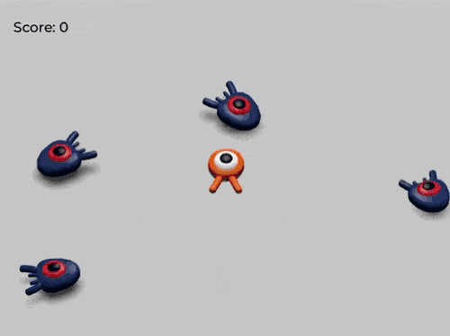

# Squash the Creeps 3D  

My first 3D game built with Godot

## About

Chase and squash the creeps by jumping on them. Get hit from the side and it's game over. The more you squash, the higher your score.

## Requirements

- Godot

## Controls

| Key | Action |
|-----|--------|
| W / ↑ | Move Forward |
| S / ↓ | Move Back |
| A / ← | Move Left |
| D / → | Move Right |
| Space | Jump |

## Running the Game

1. Open the project in Godot
2. Press F5 or click the Play button
